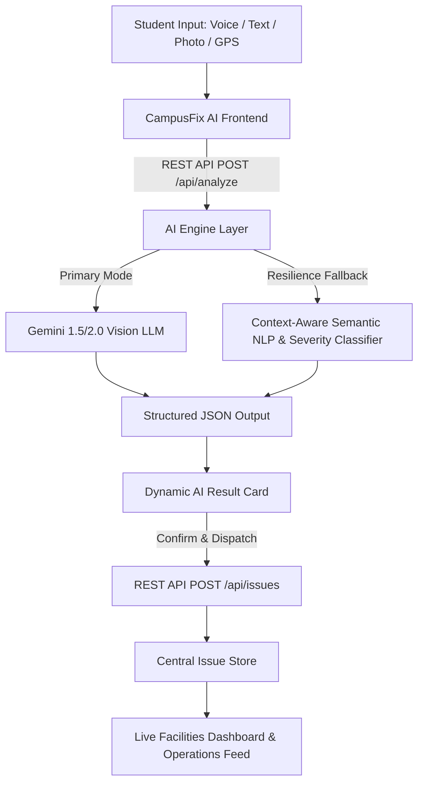

# 🛠️ CampusFix AI — AI-Powered Campus Issue Reporter

> **Hackathon Solution for Problem Statement 1: CampusFix AI**  
> *Transforming campus maintenance from slow, vague reporting into instantaneous multi-modal AI classification, safety risk scoring, and direct automated dispatch.*

---

## 🎯 Executive Summary & Pitch

In large university and college campuses, students frequently notice broken infrastructure—damaged classroom lights, leaking washroom pipes, cracked staircases, malfunctioning AV equipment, and overflowing garbage bins. 

However, reporting these issues manually suffers from three major friction points:
1. **Reporting Fatigue & Friction:** Multi-page forms or obscure university portal tickets discourage quick reports.
2. **Ambiguity & Misrouting:** Over 40% of manual campus reports lack technical detail and end up dispatched to the wrong department.
3. **Safety Urgency Delays:** Immediate hazards (exposed live wires, gushing water) get lost in the backlog of cosmetic complaints.

### 💡 The CampusFix AI Solution
A modern, zero-friction web application where students simply type a one-sentence description, speak via voice dictation, or upload a photo. 

In under **500 milliseconds**, our AI:
- ✅ **Identifies & Summarizes** the core issue
- ✅ **Categorizes** into 8 domain disciplines (*Electrical, Plumbing, Waste Management, IT/Tech, Civil, HVAC, Safety & Security, Facilities*)
- ✅ **Calculates Priority & Risk Level** (*Critical, High, Medium, Low*) based on physical and operational hazards
- ✅ **Assigns the Target Department** (*Electrical Maintenance, Water & Sanitation, Campus IT, Estate Office, etc.*)
- ✅ **Generates Actionable Directives** for maintenance technicians
- ✅ **Computes Resolution SLA** (e.g. 1 hour for critical pipe bursts, 6 hours for light replacement)

---

## 📸 Core Workflows

### 1. Zero-Friction Reporting
- **Multimodal Uploads:** Drag-and-drop photo attachment.
- **Voice Dictation:** Built-in speech-to-text recognition.
- **Campus GPS Geolocation:** Auto-detects nearest building coordinates or allows 1-click campus zone selection.
- **1-Click Test Scenarios:** Pre-configured judge presets (*Broken Library Light, Gushing Restroom Pipe, Overflowing Cafeteria Bin, Cracked Concrete Stairs, Glitching Seminar Projector*).

### 2. AI Analysis & Result Card
- Visual confidence index score.
- Color-coded category and urgency badges.
- Technical remediation guidance.
- 1-click ticket dispatch with dynamic feedback and celebration animation.

### 3. Live Facilities Operations Dashboard
- Live KPI counters: Total Tickets, Open, In Progress, Resolved, and Critical Hazards.
- Real-time search query and multi-dimensional filters (*Category, Priority, Status*).
- Ticket status progression controls (*Open ➔ In Progress ➔ Resolved*).
- Student community upvoting to prioritize recurring incidents.

### 4. Interactive Pitch Mode
- Built-in slide deck with problem context, architecture, impact metrics, and future roadmap.

---

## 🏗️ Architecture & Technology Stack



- **Backend:** Python 3.14 + Flask REST API
- **AI Intelligence:** Dual-Engine Architecture:
  - *Primary:* Google Gemini API (structured schema)
  - *Zero-Dependency Fallback:* Built-in context-aware semantic NLP and rule-based heuristic classifier (guarantees 100% offline resilience during demos)
- **Frontend:** Tailwind CSS (Modern Dark UI), Lucide Icons, Canvas-Confetti, Web Speech API, Geolocation API
- **Testing:** Python `unittest` suite (`test_campusfix.py`)

---

## 🚀 Quickstart Guide

### 1. Prerequisites
- Python 3.10+ (Python 3.14 supported)

### 2. Installation & Run
```bash
# Clone the repository
git clone <repo-url>
cd practice-hackathon

# Install dependencies
python -m pip install -r requirements.txt

# Start the CampusFix AI server
python app.py
```
Or simply double-click **`run.bat`** on Windows.

### 3. Open in Browser
Visit **`http://127.0.0.1:5000`**

---

## 🧪 Automated Testing

Run the automated test suite verifying all problem statement requirements:
```bash
python test_campusfix.py
```
**Results:** `Ran 7 tests in 0.57s — OK (100% pass)`

---

## 🏆 Hackathon MVP Compliance Matrix

| Required Capability | Status | Implementation Detail |
| :--- | :---: | :--- |
| **Report Issue Flow** | ✅ Complete | Text, voice dictation, camera/photo upload, GPS tagging, 1-click test presets |
| **Identify Issue** | ✅ Complete | AI entity extraction & concise descriptive title synthesis |
| **Categorize Issue** | ✅ Complete | Multi-class routing across Electrical, Plumbing, Waste, IT, Civil, HVAC, Safety |
| **Assign Priority** | ✅ Complete | Hazard evaluation with Critical / High / Medium / Low urgency scoring |
| **Generate Description** | ✅ Complete | Short structured description + technician action directives |
| **Recommend Department**| ✅ Complete | Automated mapping to correct campus maintenance division & SLA computation |
| **Result Card (MVP)** | ✅ Complete | High-polish interactive card with confidence score & 1-click dispatch |
| **Dashboard (Optional)**| ✅ Complete | Full facilities operations board with metrics, filters, and status toggles |
| **Hackathon Pitch** | ✅ Complete | Embedded 5-slide interactive presentation deck inside the application |

